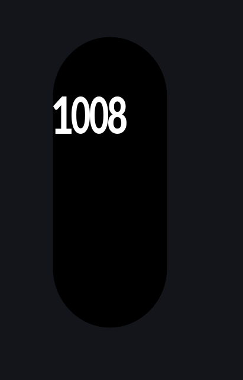

## Creating watch faces

### Setup
Create a new rust project with o9 as a dependancy, import `value_src` depending on the type of watch you're designing for (most are supported)
```rust
use o9::{value_src::xiaomi_band_9::*, Ui};

fn main() {
    let mut ui = Ui::new("overview", "../overview");
    gui(&mut ui);

    ui.build(true);
}

const BIG: u32 = 100;
const SMALL: u32 = 40;
```

### Designing 
All UI items in a `horizontal` are automatically spaced out from left to right, in the order that they're added
```rust
fn gui(ui: &mut Ui) {
    ui.spacer(100);
    
    ui.horizontal(|ui| {
        ui.number(Hour, BIG, 2);
        ui.number(Minute, BIG, 2);
    });
}
```
### Preview
